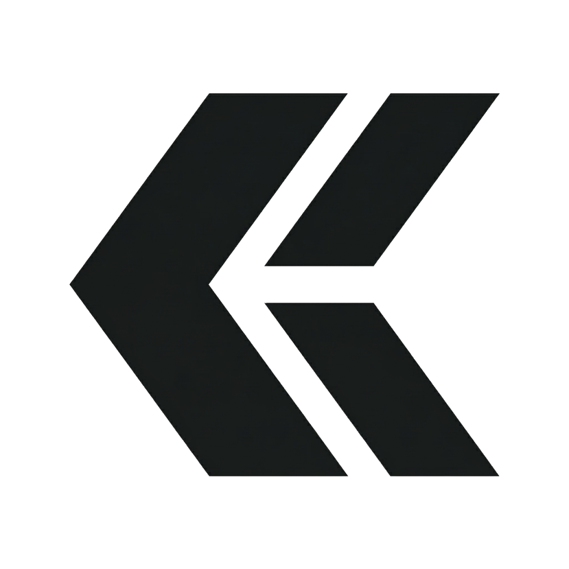

<p align="center">
  
</p>

<h1 align="center">Killio Frontend</h1>

<!-- update: comentario no funcional para commit -->

<p align="center">
  The web client for Killio, a restriction-free productivity execution platform built for teams that need boards, documents, AI support, and decision history in one operating surface.
</p>

<p align="center">
  
  
  
  
</p>

## What Is Killio?

Killio is the frontend for a collaborative execution workspace where teams can plan work, write structured documents, discuss decisions, and use AI without jumping across disconnected tools.

The product combines several surfaces that usually live in separate tabs:

- Team workspaces and onboarding flows
- Boards with lists, cards, assignees, tags, comments, and activity history
- Rich document editing with reusable content blocks called bricks
- AI copilots for drafting, summarizing, and report generation
- Realtime presence, notifications, and collaboration signals
- Public landing, auth, invite acceptance, and legal routes

The goal is simple: keep context attached to execution so work moves faster with less operational drag.

## Product Pillars

### Context-first boards

Killio boards are designed to keep planning and execution visible. Teams can create boards, organize cards across lists, assign ownership, track movement, and keep conversation close to the work.

### Structured docs, not loose notes

Documents are composed of bricks, which let teams build living documents from text, checklists, tables, graphs, accordions, media, embeds, and AI-generated content.

### AI inside the workflow

Instead of pushing users into a separate chat product, Killio brings AI into board and document flows for summarization, drafting, contextual suggestions, and technical report generation.

### Collaboration you can trust

The frontend includes invites, sharing flows, permissions, activity tracking, presence, and notifications so distributed teams can collaborate without losing visibility.

## What This Repository Contains

This repository contains the Next.js application that powers the Killio web experience, including:

- Public marketing and entry pages
- Login, signup, and invite acceptance flows
- Team, board, history, and dashboard views
- Board chat, realtime updates, and activity feeds
- Document editing and export flows
- Shared UI primitives and feature components
- API client integrations for the Killio backend

## Core Capabilities

- Boards, lists, and cards with drag-and-drop interactions via dnd-kit
- Document editor with brick-based composition
- Board and document comments, history, and sharing flows
- AI generation panels and contextual copilot actions
- Realtime collaboration through Ably channels and presence
- Internationalization support for English and Spanish
- PWA manifest and branded app icons

## Tech Stack

- Next.js 15 App Router
- React 19
- TypeScript
- Tailwind CSS
- Zustand for client-side state
- dnd-kit for board interactions
- Ably for realtime events and presence
- Recharts and HyperFormula for structured data and visualization

## Getting Started

### Prerequisites

- Node.js 20+
- npm 10+
- A running Killio backend API

### Install dependencies

```bash
npm install
```

### Environment variables

Create a local environment file such as `.env.local` and point the frontend at your backend.

```bash
NEXT_PUBLIC_API_BASE_URL=http://localhost:4000
NEXT_PUBLIC_API_URL=http://localhost:4000
```

Both variables are worth setting today because the codebase still references both names in different areas.

### Run the app

```bash
npm run dev
```

Open http://localhost:3000.

### Production build

```bash
npm run build
npm run start
```

## Scripts

```bash
npm run dev     # Start the Next.js development server
npm run build   # Create a production build
npm run start   # Serve the production build
```

## Project Shape

```text
src/
  app/                Next.js routes and layouts
  components/         Shared UI, marketing, documents, and bricks
  features/           Higher-level feature modules
  hooks/              Realtime, presence, permissions, and user hooks
  i18n/               Locale dictionaries and i18n wiring
  lib/                API clients, helpers, AI context, and utilities
  types/              Shared frontend types
public/               Brand assets, icons, and PWA files
```

## Backend Contract

This frontend expects the Killio backend to provide:

- Authentication and session flows
- Team, board, list, card, and document APIs
- Invite and membership management
- AI endpoints for generation and reporting
- Ably auth endpoints for realtime access
- Export endpoints for document output

If you are running the full platform locally, start the backend first and then launch this app.

## Brand Notes

Killio uses a dark, high-contrast visual system with a sharp execution-oriented tone. The branding in this repo includes:

- Killio logo assets in `public/killio.webp` and `public/killio_white.webp`
- PWA icons and manifest metadata under `public/` and `src/app/manifest.ts`
- A landing experience centered around clarity, momentum, and operational trust

## Status

This repo is the active frontend application for Killio and is structured as a product surface, not a component sandbox. Expect application code, integrated API flows, and product-facing UX patterns throughout the codebase.

## Related Repositories

- Killio backend API repository
- Killio contracts and shared integrations used across the wider workspace

## License

No license file is currently included in this repository.

Update note (2026-03-27): non-functional README refresh for deployment commit.